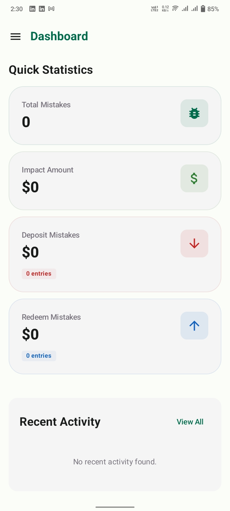

# PulseLog: KMP Finance System

PulseLog is a professional Finance Mistake Tracking System built with **Kotlin Multiplatform (KMP)**. It replaces traditional Excel-based workflows with a structured, role-based "Command Center" for tracking operational discrepancies.

## Features

*SMART AUTHENTICATION AND SECURITY FOCUS* : The app features a sophisticated login flow where entering a valid username triggers an automatic password fetch and programmatically shifts focus to a secure, fixed-box PIN entry UI.

*ADVANCED 3D ANALYTICS SUITE* : PulseLog utilizes high-impact 3D Pie Charts to visualize mistake distribution across shifts and designations, providing a modern and professional data management aesthetic.

*HYBRID ACCOUNTABILITY LOGGING* : The system implements unique "Shift-Designation" logic, allowing users to link errors to specific sub-teams like "Nig Finance" or "Eve Super" for granular operational tracking.

*REAL-TIME FINANCIAL SUMMARY TILES* : The home screen provides instant oversight with separate cards for Total Impact Amount, Total Number of Mistakes, and detailed Deposit vs. Redeem totals.

*ROLE-BASED COMMAND CENTER* : PulseLog employs strict Role-Based Access Control (RBAC) where Admins have full Edit and Delete capabilities via dedicated icons, while Agents are limited to view-only access.

*TEXTUAL ANALYSIS AND REPORTING MATRIX* : Complementing the visual charts, a comprehensive data table provides a professional textual breakdown of total mistakes and financial impact by team and shift.

*CROSS-PLATFORM KMP ARCHITECTURE* Built with Kotlin Multiplatform, the system ensures a unified business logic and high-performance user experience across both Android and Web environments.

*ADMINISTRATIVE USER MANAGEMENT SUITE* : A secure, Admin-only portal allows for the management of the workforce, including adding or removing members and configuring secure user PINs.

*IN-PLACE DATA PERSISTENCE* : The app features background data refreshing for seamless management and a manual sign-out system to ensure the "Command Center" stays ready for the next entry at all times.
Sectioned Navigation: A structured side-navigation menu separating Operations, Analytics, and System Management.

*Cross-Platform Performance* : Built with Kotlin Multiplatform (KMP) for high-performance experiences across Android and Web.

## TechStack

Kotlin Multiplatform (KMP), Compose Multiplatform, Material 3, Clean Architecture, MVVM, Ktor, SQLDelight, Coroutines, StateFlow, Kotlin-Charting, and Gemini AI.

### **📸 Project Gallery**

### **📸 Project Gallery**

| Login Screen | PulseLog Dashboard | Main Menu |
| :---: | :---: | :---: |
|  |  |  |

| New Mistake Entry | Overall Analysis | User Management |
| :---: | :---: | :---: |
|  |  |  ||  |  |
| :---: | :---: | :---: |
|  |  |  |
